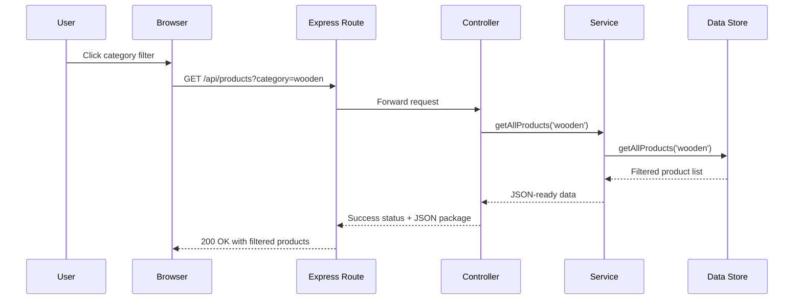

# Product Filter Submission

## Contract Table

| Trigger | Request | Processing | Response |
| --- | --- | --- | --- |
| User clicks a category such as `wooden` or `office` on the shop page. | The browser sends `GET /api/products?category=<value>`. | The Express controller reads `request.query.category`, the service forwards it, and the store filters the catalog before cloning the result. | The server returns a JSON array of matching products with HTTP `200 OK`. If the request fails, it returns HTTP `500` with an error message. |

## Sequence Diagram

## GenAI Prompt

Use this prompt to generate or explain the implementation:

> Build an Express.js API route for a furniture shop that supports `GET /api/products?category=...`. The browser sends the selected category as a query parameter. The controller should read `request.query.category`, the service should pass it to the data layer, and the data layer should return only the matching products. If no category is provided or the value is `all`, return the full catalog. Keep the response in JSON and add short comments that explain the request, processing, and response flow.
