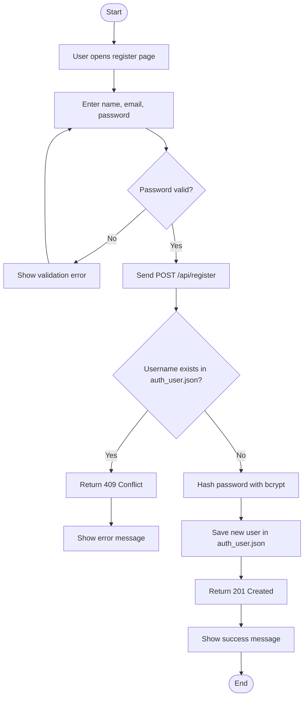
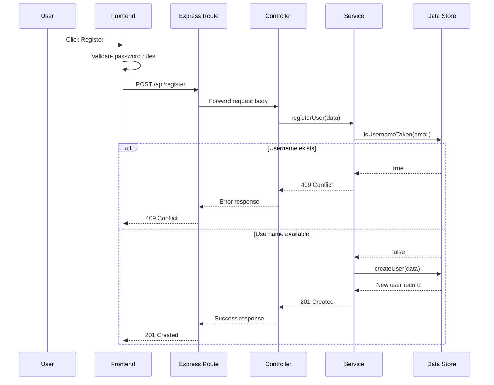

# Register Submission

## Contract Table

| Trigger | Request | Processing | Response |
| --- | --- | --- | --- |
| User fills in name, email, and password, then clicks Register. | `POST /api/register` with `firstName`, `username`, and `password`. | The frontend validates the password rules first. The backend checks whether the username already exists in `auth_user.json`, hashes the password with bcrypt, and appends the new user record. | `201 Created` with the new user summary. If the username already exists, return `409 Conflict`. If the password is invalid, return `400 Bad Request`. |

## Activity Diagram

## Sequence Diagram

## GenAI Prompt

Use this prompt to generate or explain the feature:

> Build a Node.js and Express registration flow for a furniture shop. The frontend must request a user's name, email username, and password, and validate that the password has at least 8 characters, one uppercase letter, and one special character from `! @ # $ % ^ & *`. The backend should expose `POST /api/register`, check `auth_user.json` for an existing username, return `409 Conflict` if the email already exists, hash the password with bcrypt, save the new user back to `auth_user.json`, and return `201 Created` with the new user summary. Add concise comments that explain the frontend validation, backend duplicate check, hashing, and file write steps.
